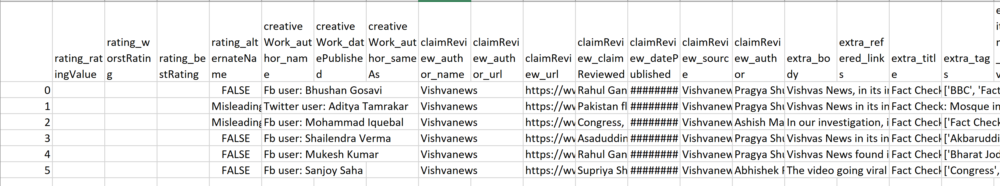
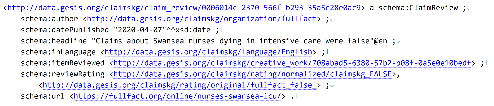
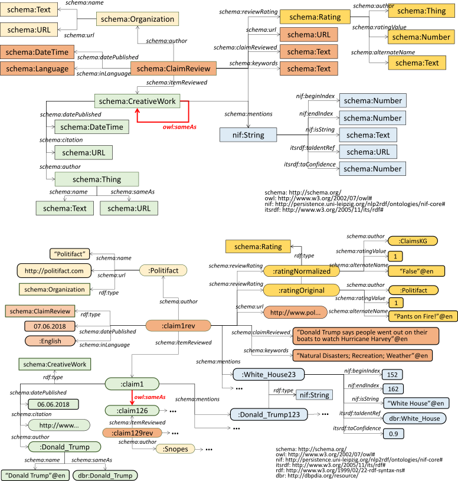

# Description
The Verified Claims Wizard is a method that generates a repository of verified claims that are collected from diverse fact-checking organizations and puts together in one place.  Each claim includes detailed information such as author, URL, date, truth values and other pertinent details, providing a rich resource of verified claims and their corresponding reviews.An user could use this method to generate a repository of claims and then search claims of their own interest based on various filter criteria.  

### Keywords
Claims, Fact-checking, Entity Linking

## Relevant research questions that could be adressed with the help of this method 

1. Spread of false political information and consequence on the soceity (Buchanan, T. (2021). Trust, personality, and belief as determinants of the organic reach of political disinformation on social media. The Social Science Journal, 1-12.)
2. How big brands are implicated with fake news (Berthon, P. R., & Pitt, L. F. (2018). Brands, truthiness and post-fact: managing brands in a post-rational world. Journal of Macromarketing, 38(2), 218-227.)
3. Investigate underlying motives for online fake news sharing during a particular event or time period (Balakrishnan, V., Ng, K. S., & Rahim, H. A. (2021). To share or not to share–The underlying motives of sharing fake news amidst the COVID-19 pandemic in Malaysia. Technology in Society, 66, 101676.)
4. Investigate social media and fake news during a particular event (Allcott, H., & Gentzkow, M. (2017). Social media and fake news in the 2016 election. Journal of economic perspectives, 31(2), 211-236.)

### Social Science Usecase

John is a researcher studying about online discourse. He wants acess to fake news within a definite time period about the US Presidential Elections. He visits the MH portal to find this method that helps him to generate a repository of fact-checked claims. He uses the search box on the top of the interface and types in Claims or Fake News. The search functionality of the MH shows him a list or related methods and tutorials that provides John with methods that can help him generate this huge collection of claims which he can then querry and find all relevant claims regarding Presidential Elections and reuse for his study.

Mary is a researcher who wants to investigate the impact of Gun laws on the society. She has a huge collection of claims, from different websites but wants to have them all at one place and search those pertaining to gun laws over a particular time period. She uses the search box to find methods related to claims or fact-checks.The search functionality of the MH shows her a list of related methods and tutorials related to claims. She then uses Verified Claims Wizard that generates a huge repository of claims out of it. She then searches this repository regarding all claims related to the Gun laws and it brings her a list of all relevant claims, be it true, false, mixed or others which she can reuse for her study.


Lily is a researcher who wants to study the evolution of false claims related to Covid or coronavirus. She collects claims from a number of fact-checking websites but does not have an easy way to pick only those that are false and also related to Covid. She uses the search box in MH to find methods related to fact-checking.The search functionality of the MH shows her a list or related methods and tutorials related to Fact-Checking that can help her generate a fact checked claims repository out of it.She generates the repository using Verified Claims Wizard and runs a search querry to find all false claims related to covid or coronavirus in a very short time. 


### Structure

ClaimsKG folder -Contains the entity annotation, RDF generation, and rating normalization module


docs folder - contains spynx documentation


export.py - The main file to run the project

### Environment SetUp
This program requires Python 3.x to run.

### Dependencies

To install the dependencies you may use: `pip3 install -r requirements.txt`


### Limitation
The method generates output based on a specified schema in the data model section. For changes and alterations in the output, modifications to the schema would be required.  

### How to Use
- For usage information you may use 
```shell
    python3 export.py -h
```
* The options are the following: 
  * `--input [file]` Indicated the location of the zip file generated by the fake new extractor (mandatory)
  * `--output [file]` Specifies the output file for the model (default: out.ttl)
  * `--format [format]` Specifies the format of the output serialization. You may use any of the supported formats in the `rdflib` package (xml', 'n3', 'turtle', 'nt', 'pretty-xml', 'trix', 'trig' and 'nquads'; default: turtle)
  * `--model-uri` The base URI of the model (by default `http://data.gesis.org/claimskg/public/`) 
  * `--resolve` Specifies whether to resolve the annotations to DBPedia URIs. If this option is activated, the resolution is performed through SPARQL queries to the official DBPedia endpoint, which requires you to have an active Internet connection. Additionally, you will need a running instance of `redis-server` as the results of the queries are cached to prevent unnecessary queries from being performed. 
  * `--threshold [float_value]` If `--resolve` is present, specifies the cutoff confidence threshold to include annotations as a mention. 
  * `--include-body` If `--include-body` is supplied, the body of the claim review is included in the `schema:ClaimReview` instances through the `schema:reviewBody` property.


### Input data
The output of Extractor module is the input to the generator module in ClaimsKG.
Sample output for Extractor module can be found at https://git.gesis.org/bda/ClaimsKG
### Sample Input to the method

### Sample Output of the method


### ClaimsKG pipeline


### Data Model




## Contact
Susmita.Gangopadhyay@gesis.org

## Publication 
1. ClaimsKG: A knowledge graph of fact-checked claims (Tchechmedjiev, A., Fafalios, P., Boland, K., Gasquet, M., Zloch, M., Zapilko, B., ... & Todorov, K. (2019). ClaimsKG: A knowledge graph of fact-checked claims. In The Semantic Web–ISWC 2019: 18th International Semantic Web Conference, Auckland, New Zealand, October 26–30, 2019, Proceedings, Part II 18 (pp. 309-324). Springer International Publishing.)
2. Truth or dare: Investigating claims truthfulness with claimskg (Gangopadhyay, S., Boland, K., Dessí, D., Dietze, S., Fafalios, P., Tchechmedjiev, A., ... & Jabeen, H. (2023, May). Truth or dare: Investigating claims truthfulness with claimskg. In D2R2’23-Second International Workshop on Linked Data-driven Resilience Research (Vol. 3401).)
  
  
 
 
 
