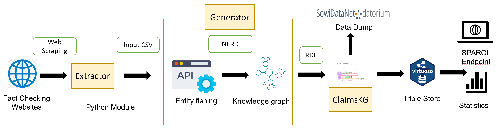

# Description
The Verified Claims Wizard is a method that generates a repository of verified claims that are collected from diverse fact-checking organizations and puts together in one place.  Each claim includes detailed information such as *author, URL, date, truth values* and other pertinent details, providing a rich resource of verified claims and their corresponding reviews. 

The method can be used to verify a collection of claims that are of interest to the user. The method reviews all claims and returns whether the claims are true or false and also provide the sources from which this information was verified. 


### Keywords
Claims, Fact-checking, Entity Linking

## Relevant research questions that could be adressed with the help of this method 

1. Spread of false political information and consequence on the soceity (Buchanan, T. (2021). Trust, personality, and belief as determinants of the organic reach of political disinformation on social media. The Social Science Journal, 1-12.)
2. How big brands are implicated with fake news (Berthon, P. R., & Pitt, L. F. (2018). Brands, truthiness and post-fact: managing brands in a post-rational world. Journal of Macromarketing, 38(2), 218-227.)
3. Investigate underlying motives for online fake news sharing during a particular event or time period (Balakrishnan, V., Ng, K. S., & Rahim, H. A. (2021). To share or not to share–The underlying motives of sharing fake news amidst the COVID-19 pandemic in Malaysia. Technology in Society, 66, 101676.)
4. Investigate social media and fake news during a particular event (Allcott, H., & Gentzkow, M. (2017). Social media and fake news in the 2016 election. Journal of economic perspectives, 31(2), 211-236.)

### Social Science Usecases

Getting access to news between certain dates about the US presidential elections and fact check the claims in these news items.

Reviewing a huge collection of claims about gun laws from different sources within a time frame and analyzing them for their impact on the society.

Studying the evolution of only false COVID-related claims from all claims collected across different fact-checking websites.


### Repository Structure

- ClaimsKG folder
  - Entity annotation
  - RDF generation
  - Util
- docs
  - Build
  - sources
  - makefile
- export.py - The main file to run the project
- LICENSE
- README.md
- requirements.txt
- postBuild

### Environment Setup
This program requires Python 3.x to run.


To install the dependencies you may use: `pip3 install -r requirements.txt`
  

### How to Use
- For usage information you may use 
```shell
    python3 export.py -h
```
* The options are the following: 
  * `--input [file]` Indicated the location of the zip file generated by the fake new extractor (mandatory)
  * `--output [file]` Specifies the output file for the model (default: out.ttl)
  * `--format [format]` Specifies the format of the output serialization. You may use any of the supported formats in the `rdflib` package (xml', 'n3', 'turtle', 'nt', 'pretty-xml', 'trix', 'trig' and 'nquads'; default: turtle)
  * `--model-uri` The base URI of the model (by default `http://data.gesis.org/claimskg/public/`) 
  * `--resolve` Specifies whether to resolve the annotations to DBPedia URIs. If this option is activated, the resolution is performed through SPARQL queries to the official DBPedia endpoint, which requires you to have an active Internet connection. Additionally, you will need a running instance of `redis-server` as the results of the queries are cached to prevent unnecessary queries from being performed. 
  * `--threshold [float_value]` If `--resolve` is present, specifies the cutoff confidence threshold to include annotations as a mention. 
  * `--include-body` If `--include-body` is supplied, the body of the claim review is included in the `schema:ClaimReview` instances through the `schema:reviewBody` property.


### Digital Behavioral data
The method works with claims collected from various fact-checking websites, structured through claims extractor. 

### Sample Input 
The output of Extractor module is the input to the generator module in ClaimsKG.
Sample output for Extractor module can be found at https://git.gesis.org/bda/ClaimsKG. Sample input below

### Sample Output


### ClaimsKG pipeline



### Data Model


### Limitation
The method generates output based on a specified schema in the data model section. For changes and alterations in the output, modifications to the schema would be required


## Contact
Susmita.Gangopadhyay@gesis.org

## Publication 
1. ClaimsKG: A knowledge graph of fact-checked claims (Tchechmedjiev, A., Fafalios, P., Boland, K., Gasquet, M., Zloch, M., Zapilko, B., ... & Todorov, K. (2019). ClaimsKG: A knowledge graph of fact-checked claims. In The Semantic Web–ISWC 2019: 18th International Semantic Web Conference, Auckland, New Zealand, October 26–30, 2019, Proceedings, Part II 18 (pp. 309-324). Springer International Publishing.)
2. Truth or dare: Investigating claims truthfulness with claimskg (Gangopadhyay, S., Boland, K., Dessí, D., Dietze, S., Fafalios, P., Tchechmedjiev, A., ... & Jabeen, H. (2023, May). Truth or dare: Investigating claims truthfulness with claimskg. In D2R2’23-Second International Workshop on Linked Data-driven Resilience Research (Vol. 3401).)
  
  
 
 
 
